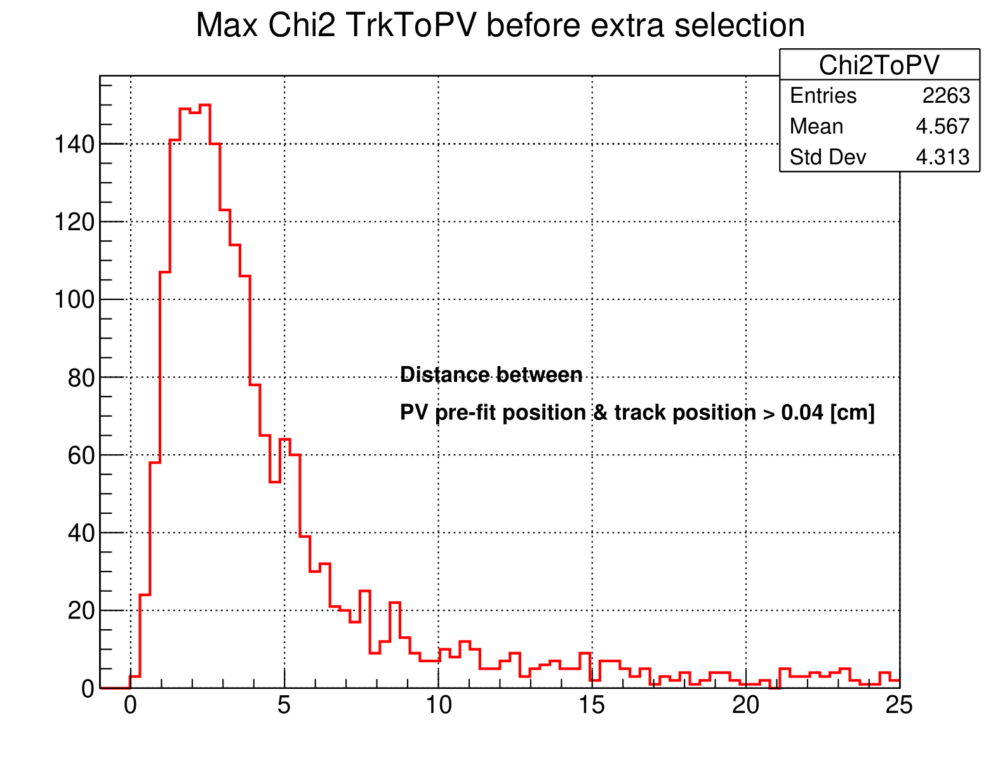
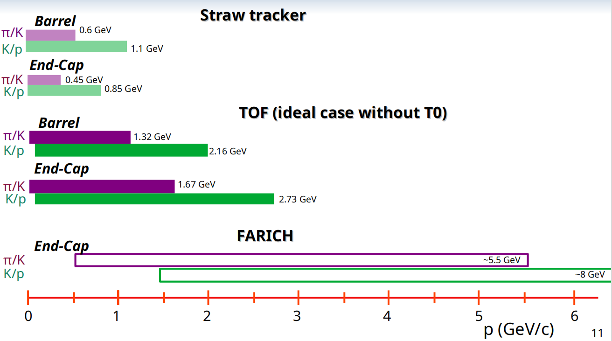

# Data Description

## Main Info: 
* Number of Features: 60
* Number of Entries: 
    * Signal: 327218
    * Background: 1249418

## Table of Contents  
[1. SoftWare](.README.md#SoftWare)  
[2. Generator Description](.README.md#Generator-Description)  
[3. Reconstructor Description](.README.md#ReconstructorDescription)  
[4. Dataset Creation](.README.md#Dataset-Creation)  
[5. Features Description](.README.md#Features-Description)


# SoftWare
* SpdRoot 4.1.7.4
* KFParticle
* Pythia8
## Scripts:
* sim_lambda_new.cpp &mdash; Generator and Detector Modeling
* reco_event_lambda_new.cpp &mdash; Reconstructor
* analyze_Lc_pKpi_27_cluster.cpp &mdash; Secondary Vertex Reconstruction
* analyze_Lc_pKpi_27_cluster_tree_MB.cpp &mdash; Secondary Vertex Reconstruction (MB only)

# Generator & Detector Description
* Number of Events: 
    * Signal: 2.115 M
    * Background: 39.2 M
* Beams parameters:
    ```cpp
    P8gen -> SetBeam(2212, 2212, 27.);
    primGen->SetBeam(0., 0., 0.1, 0.1);
    primGen->SmearGausVertexXY(kTRUE);
    primGen->SetTarget(0., 30.);
    primGen->SmearGausVertexZ(kTRUE);
    ```
* Subpprocesses:
    * Signal:
        ```cpp
        P8gen -> SetParameters("HardQCD:gg2ccbar = on");
        P8gen -> SetParameters("HardQCD:qqbar2ccbar = on");
        P8gen->SetParameters("PhaseSpace:pTHatMin = 1.");
        ```
    * Background: 
        ```cpp
        P8gen -> SetParameters("SoftQCD:all = on");
        ```
* Select events only with $\Lambda_c^+$ production
* Forced decay: $\Lambda_c^{+} \to p^{+}K^{-}\pi^{+}$
* Vertex Detector:
    * DSSD
* Particle Identification:
    * Time-of-Flight System

# Reconstructor Description
* Preselection for tracks parameters:
    ```cpp
    track_finder->CheckMinItsHits(true,0);
    track_finder->CheckMinTsHits(true,6);
    track_finder->CheckMinHits(true,7);
    track_finder->CheckMaxPartGeneration(true, 3);
    track_finder->CheckMinPartPt(true,0.1);
    track_finder->CheckMinPartMomentum(true,0.15);
    ```


# Dataset Creation

## Primary Vertex Reconstruction

### Reconstruction Strategy
    
    Initial Vertex Finding:

    * Pre-fit position from standard SPDRoot RCVertex
    * Track-to-PV distance < 0.4 cm
    * Minimum 5 tracks per PV
        
                
    Vertex Refinement:
    * Sequential track deletion
    * Remove tracks with $\chi^2_{\text{PV}} > 9$
    * Iterative improvement


*Figure 1: Max $\chi^2$ impact parameter of track to PV distribution before extra selection (3000 Open Charm events)*

### PV Reconstruction Performance

    Subset of 3000 Open Charm events:
    * Mean number tracks per vertex: 9.12
    * Mean PV Chi2: 23.19
    * Mean removed tracks: 0.25
    * PV acceptance: 75.4%

    Final performance for main analysis:

    Transverse ($\sigma_x$) & 77 $\mu$m
    Transverse ($\sigma_y$) & 77 $\mu$m
    Longitudinal ($\sigma_z$) & 100 $\mu$m

result picture ...

#### Particle Identification

Using SoftMax function transform LikelyHoods for p, K, $\pi$ to probabilities. Then takes Max probability if its value is higher then 0.4 else track is not accepted.


link to PID analysis project here



*Figure 2: Different PID Systems Resolution from Particke Momentum Dependensies*


#### Tracks Selection for Secondary Vertex Reconstruction included in Count Reduction

* NHitsIts > 2

#### Counts Reduction in $M_{\Lambda_c^+} \in (2.24763; 2.32497)$ $GeV$:
* Signal: 0.612331
* Background: 0.564550

### Initial Number of Counts in $M_{\Lambda_c^+} \in (2.24763; 2.32497)$ $GeV$:
* Signal: 72628
* Background: 441934

### Features Description

### $\Lambda_c^+$ Analysis Features:

#### Event Information:
- **n_event** &mdash; Event number from modeling (may contain duplicates)
- **multiplicity** &mdash; Number of reconstructed tracks in the event

#### Primary Particle Properties:
- **mass_Lc** &mdash; Reconstructed invariant mass of $\Lambda_c^+$ candidate
- **Pt_Lc** &mdash; Transverse momentum of reconstructed $\Lambda_c^+$
- **P_Lc** &mdash; Total momentum of reconstructed $\Lambda_c^+$
- **eta_Lc** &mdash; Pseudorapidity of reconstructed $\Lambda_c^+$
- **xF** &mdash; Feynman-x variable of $\Lambda_c^+$
- **phi_angle** &mdash; Azimuthal production angle ($\phi$) of $\Lambda_c^+$


#### Decay Vertex Properties:
- **length_Lc** &mdash; $\Lambda_c^+$ decay length (3D)
- **lengthXY_Lc** &mdash; $\Lambda_c^+$ decay length in transverse plane
- **dLength_Lc** &mdash; Uncertainty of $\Lambda_c^+$ decay length (3D)
- **dLengthXY_Lc** &mdash; Uncertainty of $\Lambda_c^+$ decay length in transverse plane
- **ctau_Lc** &mdash; Proper decay length ($c\tau$) of $\Lambda_c^+$
- **chi2_Lc** &mdash; $\chi^2$ of $\Lambda_c^+$ decay vertex fit

### Daughter Particle Kinematics:

#### Proton ($p^+$) Candidate:
- **P_p** &mdash; Momentum
- **Pt_p** &mdash; Transverse momentum  
- **eta_p** &mdash; Pseudorapidity
- **OA_p** &mdash; Opening angle

#### Pion ($\pi^+$) Candidate:
- **P_pip** &mdash; Momentum
- **Pt_pip** &mdash; Transverse momentum
- **eta_pip** &mdash; Pseudorapidity  
- **OA_pip** &mdash; Opening angle

#### Kaon ($K^-$) Candidate:
- **P_K** &mdash; Momentum
- **Pt_K** &mdash; Transverse momentum
- **eta_K** &mdash; Pseudorapidity
- **OA_K** &mdash; Opening angle

### Vertex Association Parameters:

#### Primary Vertex (PV) Relations:
- **chi2_Lc_PV** &mdash; Impact parameter $\chi^2$ of $\Lambda_c^+$ trajectory to PV
- **dist_Lc_PV** &mdash; Distance of $\Lambda_c^+$ trajectory to PV

#### Track-PV Impact Parameters:
- **chi2_p_PV** &mdash; $p^+$ impact parameter $\chi^2$ to PV
- **dist_p_PV** &mdash; $p^+$ distance to PV
- **chi2_pip_PV** &mdash; $\pi^+$ impact parameter $\chi^2$ to PV  
- **dist_pip_PV** &mdash; $\pi^+$ distance to PV
- **chi2_K_PV** &mdash; $K^-$ impact parameter \chi^2 to PV
- **dist_K_PV** &mdash; $K^-$ distance to PV

#### Decay Vertex Relations:
- **chi2_p_Lc** &mdash; $p^+$ impact parameter $\chi^2$ to $\Lambda_c^+$ vertex
- **dist_p_Lc** &mdash; $p^+$ distance to $\Lambda_c^+$ vertex
- **chi2_pip_Lc** &mdash; $\pi^+$ impact parameter $\chi^2$ to $\Lambda_c^+$ vertex
- **dist_pip_Lc** &mdash; $\pi^+$ distance to $\Lambda_c^+$ vertex  
- **chi2_K_Lc** &mdash; $K^-$ impact parameter $\chi^2$ to $\Lambda_c^+$ vertex
- **dist_K_Lc** &mdash; $K^-$ distance to $\Lambda_c^+$ vertex

#### Track-Track Correlations:
- **chi2_K_pip** &mdash; Impact parameter $\chi^2$ between $K^-$ and $\pi^+$
- **dist_K_pip** &mdash; Distance between $K^-$ and $\pi^+$
- **chi2_p_K** &mdash; Impact parameter $\chi^2$ between $p^+$ and $K^-$
- **dist_p_K** &mdash; Distance between $p^+$ and $K^-$
- **chi2_p_pip** &mdash; Impact parameter $\chi^2$ between $p^+$ and $\pi^+$
- **dist_p_pip** &mdash; Distance between $p^+$ and $\pi^+$

### Geometric Consistency Variables:
- **cosAngle_r_Lc_momentum_Lc** &mdash; ~~Cosine~~Just angle between $\Lambda_c^+$ flight vector and momentum (XY-plane)
- **cosAngle_r_Lc_sum_momentum** &mdash; ~~Cosine~~Just angle between $\Lambda_c^+$ flight vector and sum of daughter momenta (XY-plane)
- **cosAngle_momentum_Lc_sum_momentum** &mdash; ~~Cosine~~Just angle between $\Lambda_c^+$ momentum and sum of daughter momenta (XY-plane)
- **ptOverE** &mdash; $\Lambda_c^+$ transverse momentum over sum energy of tracks with $\theta$ > 0.174533

### Monte Carlo Truth Information:
- **true_decay** &mdash; Flag indicating true $\Lambda_c^+$ decay reconstruction

### Vertex Position Differences:
#### $\Lambda_c^+$ Vertex Resolution (invalid for true_decay == False)
- **Lc_diff_x** &mdash; $\Delta x$ between true and reconstructed $\Lambda_c^+$ vertex (MC truth)
- **Lc_diff_y** &mdash; $\Delta y$ between true and reconstructed $\Lambda_c^+$ vertex (MC truth)  
- **Lc_diff_z** &mdash; $\Delta z$ between true and reconstructed $\Lambda_c^+$ vertex (MC truth)

#### Primary Vertex Resolution
##### Before PV Re-reconstruction
- **PV_diff_x** &mdash; $\Delta x$ between true and reconstructed PV
- **PV_diff_y** &mdash; $\Delta y$ between true and reconstructed PV
- **PV_diff_z** &mdash; $\Delta z$ between true and reconstructed PV

##### After Iterative PV Re-reconstruction
- **PV_diff_ES_x** &mdash; $\Delta x$ between true and re-reconstructed PV
- **PV_diff_ES_y** &mdash; $\Delta y$ between true and re-reconstructed PV  
- **PV_diff_ES_z** &mdash; $\Delta x$ between true and re-reconstructed PV